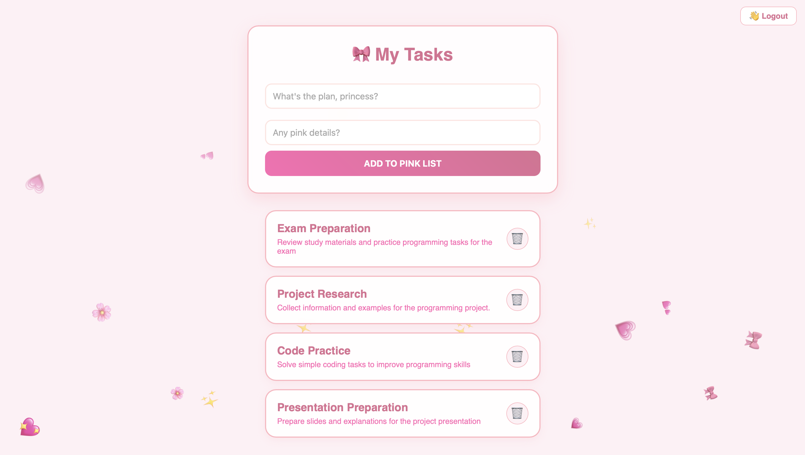

# 🎀 Pink Tasks: Enterprise-Grade Task Management System 🎀

  
  
  
  
  

## ✨ Project Philosophy
**Pink Tasks** is a sophisticated full-stack ecosystem where high-performance asynchronous engineering meets a refined "Pink Aesthetic" interface. This project goes beyond basic CRUD, implementing professional-grade features like **Eager Loading**, **Many-to-Many relational logic**, and **Role-Based Access Control (RBAC)**.

---

## 📸 Visual Showcase

  <h3 align="center">Login Interface</h3>
  

  <h3 align="center">Dashboard</h3>
  

---

## 🛠 Advanced Technical Implementation

### 🚀 High-Performance Backend
- **FastAPI Core:** Fully asynchronous architecture leveraging `BackgroundTasks` for non-blocking I/O.
- **SQLAlchemy ORM:** Professional database management featuring **Many-to-Many** relationships via association tables.
- **Eager Loading:** Optimized SQL execution using `joinedload` to prevent N+1 query problems when fetching task tags.

### 🔐 Security & Architecture
- **JWT Authentication:** Secure, state-less identity management.
- **RBAC (Role-Based Access Control):** Granular permissions separating `Admin` and `User` capabilities.
- **Data Integrity:** Implementation of `cascade="all, delete-orphan"` to maintain relational cleanliness.

### 📊 Data Intelligence (Pydantic V2)
- **Strict Validation:** Utilization of `EmailStr`, `Field(min_length=...)`, and complex constraints (`ge=18`, `le=120`).
- **Nested Models:** Clean serialization of nested structures (Address -> Order -> Items).

---

## 📡 API Architecture & Endpoints

| Category | Method | Endpoint | Advanced Logic |
|:--- |:--- |:--- |:--- |
| **Auth** | `POST` | `/auth/register` | User registration with Bcrypt hashing |
| **Auth** | `POST` | `/auth/token` | JWT token issuance for secure sessions |
| **Tasks** | `GET` | `/tasks/` | **Filtering (search/done) & Pagination** |
| **Tasks** | `POST` | `/tasks/` | **Auto-Tag Sync**: Reuse or create tags dynamically |
| **Tasks** | `PUT` | `/tasks/{id}` | Full task & tag synchronization |
| **Tasks** | `DELETE`| `/tasks/{id}` | Secure resource removal |
| **Admin** | `GET` | `/tasks/admin/all`| **Privileged Access**: Global system overview |

---

## 🧬 Database Model Structure

- **User Model:** Stores identity, hashed credentials, and system roles.
- **Task Model:** Primary data unit with links to authors and tag collections.
- **Tag Model:** Flexible categorization system.
- **Association Bridge:** `task_tags` table managing the complex many-to-many relationship.

---

## 🚀 Deployment & Quick Start

**1. Clone & Navigate:**
git clone 
cd fastapi-university-project

**2. Setup Environment:**
pip install fastapi uvicorn sqlalchemy passlib[bcrypt] python-jose[cryptography] httpx jinja2 aiofiles pydantic[email]

**3. Launch System:**
uvicorn main:app --reload

**4. Interactive Documentation:**
Explore every endpoint in real-time via **Swagger UI**: `http://127.0.0.1:8000/docs` 🎀

---

  Designed with 💗 for a seamless Task Management experience.

